Methodology
-----------

I recruited 4 usability test participants who use OpenPGP in Thunderbird to
protect sensitive information as part of their work or activism. They use and
advocate for OpenPGP as a way to protect their communications from surveillance
and repression from State and private actors. I call them **at-risk** users:

- P1 (Germany), from an international peasant movement
- P2 (Brazil), from feminist digital care network
- P3 (Colombia), from a local social movement
- P4 (Guatemala), a journalist and digital security trainer

I asked them to perform 3 tasks on each of Proposal A and Proposal B, on
improved versions after the feedback received on
[Mural](https://app.mural.co/t/nf3836/m/nf3836/1624980164516/d63fba04b062ea4c77d32b9c66e120f4bdffc64a?sender=1f9ca67c-ab56-4c87-bd58-4b29d55a52df)
using the [think aloud
protocol](https://www.nngroup.com/articles/thinking-aloud-the-1-usability-tool/):

- *Write an email to your friend renata@riseup.net about an upcoming secret action.*

  The user already had accepted a key for renata@riseup.net.

- *Write an email to book a class with your yoga teacher hello@yoga.life.*

  The participant had no key for hello@yoga.life and none was available on the key servers.

- *Write an email to schedule a meeting with a working group at your
  organization: derya@humanrights.org, kim@humanrights.org, and
  alex@humanrights.org.*

  The participant had an unaccepted key for kim@humanrights.org.
  The participant had no key for alex@humanrights.org and none was available on the key servers.

Both proposals were displayed to the test participant as paper prototypes that
I manipulated following their instructions and shared on video. I improved on
each proposal after each test, as a way of improving on the design as quickly
and cheaply as possible. This method is called [formative
testing](https://simplysecure.org/blog/formative-testing).

Gus Andrews helped interview, facilitate, and debrief the tests with P1 and P2.

Proposal A vs Proposal B
------------------------

Below is an example screen of Proposal A:

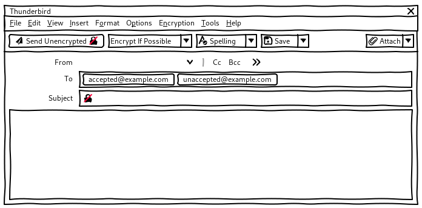

Below is an example screen of Proposal B:

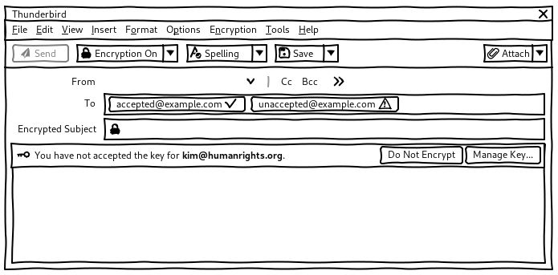

All tests participants could use fine both proposals.

When asked which one they prefer, all test participant preferred Proposal B.

They liked the simpler encryption split button and the key notifications
combined with the Never Encrypt dialog that
provide just-in-time help.

> Proposal B is much better. I can choose if I want encryption to be on
> or not in general. If choose encryption to be off by default, I can still
> turn it on for some people. Having these 2 options is more clear and
> coherent. I like the "Never Encrypt" dialog.
> ---&nbsp;P1

> Proposal B is better for me, with encryption on by default. I expect the
> program to tell me if I can't send because of a missing key. I like the
> advice.
> ---&nbsp;P2

> I like "Encrypt If Possible" and "Require Encryption" in Proposal A, but
> "Encryption On" and "Encryption Off" are super clear as well. I like the
> "Send Encrypted" button in Proposal A but I prefer the notification of
> Proposal B.
> ---&nbsp;P3

> I like "Encrypt If Possible" in Proposal A. But I like that Proposal B ask
> you to confirm when the email will be sent unencrypted. I prefer B because if
> we imagine that more people start encrypting, it will become better to
> confirm before sending unencrypted emails.
> ---&nbsp;P4

P1, the test participants with less experience with OpenPGP, was also the most
confused by Proposal A.

- The combination of the 1 widgets for "what will happen" (eg. "Send
  Encrypted") and "what the user wants" (eg. "Encrypt If Possible") seemed
  confusing to P1:

  > That's a bit confusing. I have 3 options: "Encryption", "Send Encrypted",
  > and "Encrypt If Possible". I already said that it's ok to encrypt if
  > possible, so I don't know why I should still make the choice. If it's not
  > possible, it's not possible anyway. ---&nbsp;P1

- "Encrypt If Possible" sounded too uncertain to P1:

  > When I really want the information to be protected, 'Encrypt If Possible'
  > is the wrong option because I need to be sure that it's going to be
  > encrypted. ---&nbsp;P1

- The options in the split button didn't seem logic to P1:

  > "Do Not Encrypt" is not logic because I already have a "Send Unencrypted"
  > button. That option I don't need. "Encrypt If Possible" is not logic either
  > because I don't have a key for this person. ---&nbsp;P1

In the rest of this document, I describe an improved version of Proposal B
only.

Overview
--------

**Example screen**

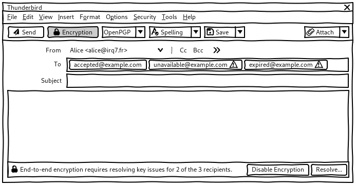

**Summary**

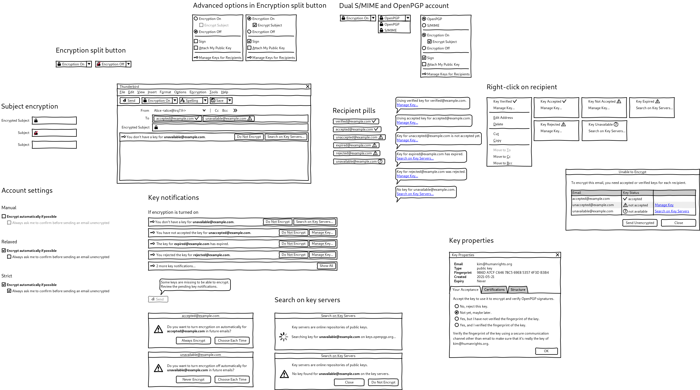

Account settings
----------------

The account settings should allow people to choose between at least 2 big
categories: those who want to encrypt as little as possible and those who want
to encrypt as much as possible (or everything):

- According to [Ruoti et al.](https://arxiv.org/pdf/1510.08554.pdf), only 20%
  of non at-risk users agree with the idea that they would "encrypt email
  frequently.”.

  > Well, I'm trying to think when I would need to. It would be nice to have
  > it, in case,  but I don't know if there's anyone I would need to send that
  > information to.

- The at-risk users who were interviewed during the usability tests want to:

  * Encrypt as much as possible.

    > If encryption is possible, it's good that it's done.
    > ---&nbsp;P1

    > The logic should be to encrypt as much as possible not to attract
    > extra attention to communications that are indeed sensitive.
    > ---&nbsp;P4

  * Be asked what to do with key issues as part of sensitive communications.

  The challenge for at-risk users is to introduce enough friction in the
  composer to prevent them from sending sensitive communications unencrypted,
  while not adding too much extra burden when sending unencrypted emails.

  For example, if the key of a contact expired yesterday, they want to be
  prevented from sending them an unencrypted email by mistake. But they don't
  want to be bothered about encryption each time they write to their yoga
  teacher who doesn't use OpenPGP.

This dinstinction can be summarized in the account settings with the following:

Or (not tested yet):

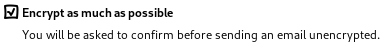

It would replace the current radio buttons:

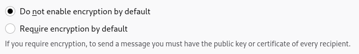

If we want to give the use more control over how much friction the composer
adds to prevent them from sending an unencrypted email by mistake, we can add
another suboption. This suboption would allow the user to choose between 3
modes, which could roughly map to the modes discussed on
[Topicbox](https://thunderbird.topicbox.com/groups/e2ee/Tcb4b3decdb7e66ce/require-encryption-vs-optional-encryption):

- Manual

  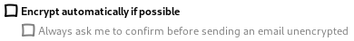

- Relaxed

  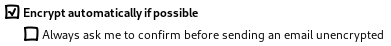

  But, at-risk users prefer some kind of interaction within the composer to
  learn and solve key issues and erring on the side of caution.

  I don't think that any of the test participants would prefer a *Relaxed* mode
  that would not prevent them from sending an unencrypted email by mistake to
  someone whose key expired the day before.

  > Sometimes you exchange keys and you think that you have it but something
  > goes wrong. I prefer to be asked whether to send unencrypted instead of
  > having a bad surprise.
  > ---&nbsp;P3

- Strict

  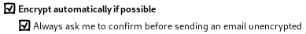

  But, at-risk users also send many unencrypted emails and would not want a
  **Strict** mode that make it too cumbersome or entirely prevents sending
  unencrypted emails.

  > With "Require Encryption", if 70-80% of the people I write to don't use a
  > key, I'll have to say 'no' almost everytime. It'll be yet another step in
  > the process of sending an email.
  > ---&nbsp;P4

This means that, at-risks users actually want something inbetween a **Relaxed**
mode that could be too silent and a **Strict** mode that could be to
cumbersome.

I believe that the status and notification mechanisms described below can
introduce the right amount of friction in the composer to keep at-risk users
both safe and efficient without having them to choose between a second
suboption. See the [recipient pills](#recipient-pills) and [key
notifications](#key-notifications).

The additional friction that would be added by the option **Always ask me to
confirm before sending an email unencrypted** should be discussed and better
defined.

For example, **Always ask me** could:

- Always display the [recipients dialog](#about-the-recipients-dialog) when sending.
- Not provide the [Never Encrypt dialog](#never-encrypt-dialog) dialog.

**Bugzilla**

- [#135636: Implement "Encryption when possible" option for OpenPGP and S/MIME](https://bugzilla.mozilla.org/show_bug.cgi?id=135636)

Encryption split button
-----------------------

Whether the user wants to encrypt the email or not is displayed in the label of
the **Encryption** split button in the toolbar, left of the **Send** button.

**Default state**

When opening the composer, encryption if turned on by default depending on
various heuristics:

- If the account is configured to **Encrypt automatically if possible**.
- If the email is a reply to or a forward of an encrypted email.

This split button is only displayed if OpenPGP or S/MIME is configured for the
current account.

**Question**: Is it OK to change the toolbar and top-level menus based on the
*From* address in case the user have 1 account with OpenPGP and 1 account
without OpenPGP for example? Otherwise we can have them displayed as long as
the user as at least 1 account with OpenPGP or S/MIME.

**Widget**

- According to Alex, a split button is easier to implement than, for example, an
  **Encrypt** checkbox, which we also considered. Test participants had no
  problem with the **Encryption On** and **Encryption Off** labels and nobody had
  a strong preference for a checkbox.

  

- Merging the encryption toggle and additional options provides everything in
  the same widget under a single padlock icon. Split buttons were well
  understood by test participants.

- State-switch controls are [notoriously hard to get
  right](https://www.nngroup.com/articles/state-switch-buttons/). Reenforcing
  the toggle with a change in label and icon provides multiple and strong
  signifiers and is more accessible.

  > “Encryption On” and “Encryption Off” are super clear. ---&nbsp;P2

- The **Quick Filter** feature uses a simple 3D toggle, but pressing it has
  visible consequences beyond changing the state of the button, by displaying
  the quick filter toolbar. It's also not mission critical.

  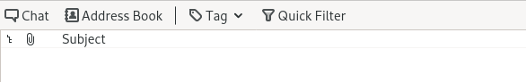

  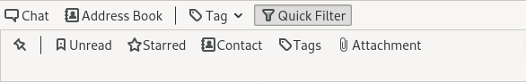

**Bugzilla**

- [#1630405: In composer, show message encryption "configuration"](https://bugzilla.mozilla.org/show_bug.cgi?id=1630405)
- [#1681938: User experience: make it easier to see if messages to be sent will be encrypted/signed](https://bugzilla.mozilla.org/show_bug.cgi?id=1681938)
- [#1669788: Support encrypt/sign toggle buttons in compose window](https://bugzilla.mozilla.org/show_bug.cgi?id=1669788)
- [#1651045: Improve labels "require encryption" and "do not encrypt" in composer](https://bugzilla.mozilla.org/show_bug.cgi?id=1651045)
- [#1680815: Automatically enable encryption based on message recipient](https://bugzilla.mozilla.org/show_bug.cgi?id=1680815)

Recipient pills
---------------

If encryption is turned on, the status of the key for each recipient is
displayed in their recipient pill:

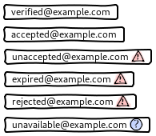

The icons were well understood by test participants and are simple enough to
improve accessibilty at a very small size.

These pills are completed with a tooltip that provides more information and a
possible solution on hover:

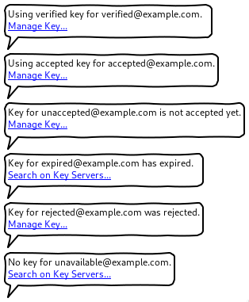

The status of the key is also available in the right-click menu of the
recipient pill:

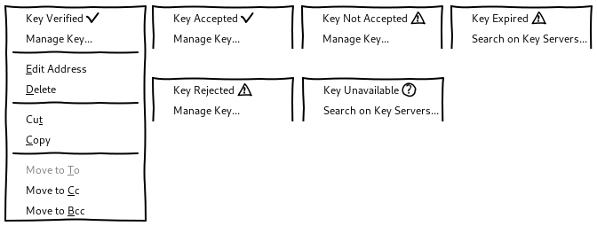

**Bugzilla**

- [#1630433: In composer, show individual message encryption "status"](https://bugzilla.mozilla.org/show_bug.cgi?id=1630433)
- [#1630416: In composer, show overall pre-calculated message encryption "status"](https://bugzilla.mozilla.org/show_bug.cgi?id=1630416)
- [#1667254: Improve the UI of the Compose window when encrypting emails](https://bugzilla.mozilla.org/show_bug.cgi?id=1667254)

Key notifications
-----------------

If encryption is turned on, the recipient pills are completed with
notifications that appear on top of the body of the email:

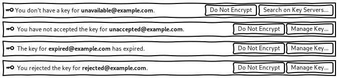

Several notifications are be visible at the same time. After 3
notifications, a single notification summarizes how many more notifications are
not displayed yet:

> If I'm serious about encryption, problems should be shown right away because
> I have to act on them anyway. The emails I work a lot with I have an interest
> in getting them in order. Progressively, more and more people will use PGP
> and the list will get lower in the future. It would be good to have these
> notifications because if I have 10 recipients, I don't have to click on 10
> addresses. I can immediately start to address the problems from the
> notification. --&nbsp;P1

Never Encrypt dialog
--------------------

When the user chooses **Do Not Encrypt** in a notification:

- The **Encryption** split button is turned off.

- The user is proposed to remember this preference for this
  recipient in the future:

  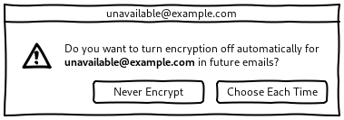

  This choice is undone automatically if the user ever imports a key for this
  recipient in the future.

Send button
-----------

If encryption is turned on but the email is impossible to encrypt, the **Send**
button is made unavailable and a tooltip instructs the user to review pending
key notifications:

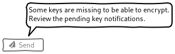

About the recipients dialog
---------------------------

If encryption is turned on but the email is impossible to encrypt, we could
instead keep the **Send** button available and display the recipients dialog with
a list of recipients and keys when the users chooses to send the email:

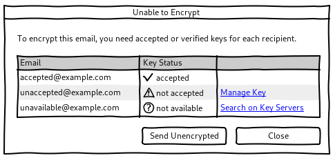

Recipient pills provide better user experience than only displaying the
recipients dialog because:

- If encryption is possible because all keys are fine, the UX is basically the same.

  **Question**: Should we try removing the "check" icon on good keys and only
  display errors and missing keys? Is reassuring people with the "check" icon
  worth the additional icon?

- Recipient pills provide better *visibility of system status*
  ([Usability Heuristics #1](https://www.nngroup.com/articles/visibility-system-status/)):

  * They present feedback to the user as quickly as possible.

  * Without this immediate feedback, the encryption toggle would remain on
    while it's actually impossible to encrypt and without telling the user. The
    **Send** button will feel uncertain. Predictable interactions create trust.

- Recipient pills rely on *recognition rather than recall*
  ([Usability Heuristics #6](https://www.nngroup.com/articles/recognition-and-recall/)):

  * They inform the user about whether it is possible to encrypt without having
    to recall, guess, or wait until they try to send. They provide help in
    context.

- Key notifications *help users recognize, diagnose, and recover from errors*
  ([Usability Heuristics #9](https://www.nngroup.com/articles/ten-usability-heuristics/)):

  * They describe the problem and provide shortcuts that can solve the error immediately.

Once we have the recipient pills and key notifications, we could
get rid of the code for this window and save a bit on maintenance.

Additional options
------------------

The same OpenPGP and S/MIME options are available from either:

- The **Encryption** split button.
- A dedicated top-level **Encryption** menu.

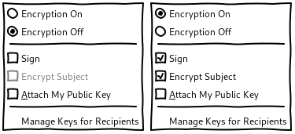

According to Kai, the options from the split button should also be available
from a top-level menu for accessibility.

Moving OpenPGP and S/MIME options to a dedicated top-level menu helps making
them more discoverable. It also keeps the set of options in the split button
and the top-level menu consistent and helps people understand that the
top-level menu mirrors the options in the split button.

It wouldn't be a problem to keep these options in the **Options** menu as we're
doing right now as most people will rather use the split button than the
top-level menu.

The label of the **Encryption** menu is slightly incorrect
technically because this menu also includes options for
cryptographic signatures, and not only for encryption. Test
participants didn't care or didn't even know about the
cryptographic signature of OpenPGP. I assume that the
**Encryption** label is clearer and most discoverable by the vast
majority of users that are mostly interested in encryption. I
assume that the few people who are also interested in
cryptographic signatures won't have problems finding these options
in this menu despite the **Encryption** label.

OpenPGP-S/MIME split button
---------------------------

If the user has accounts with both OpenPGP and S/MIME, the choice between both encryption technologies is available from:

- A dropdown, left from the **Encryption** split button.
- Radio buttons, in the **Encryption** menu.

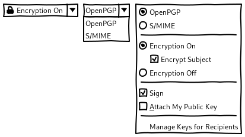

Search on key servers
---------------------

Searching on key servers is made available from the recipient pills, their
right-click menu, and the key notifications.

None of the test participants used key servers to share their keys: some don't
know that they exist and some others avoid using them by lack of trust.

> I never search on key servers because I don't trust them. Someone
> can pretend to be someone else and send a wrong key.
> ---&nbsp;P2

When the user searches on key servers, it's a good opportunity to educate them
about key servers:

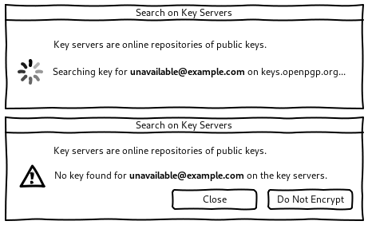

Key properties
--------------

P1 didn't read the current text despite being interested in learning more
about fingerprint verification.

> I don't know what a fingerprint is so I would choose 'accepted'.
> I don't know how I can verify if the key is correct but I'm curious
> but I’m curious what a correct fingerprint means. I want to know. I
> would like an explanation of difference between 'accepted' and
> 'verified'.
> ---&nbsp;P1

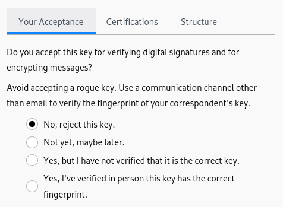

I rephrased and restructured the acceptance tab of the key properties to:

- Be less verbose on top.
- Explain better what it means to verify the fingerprint, put this
  explanation closer to where it matters, and separate it from the general
  explanation on acceptance.

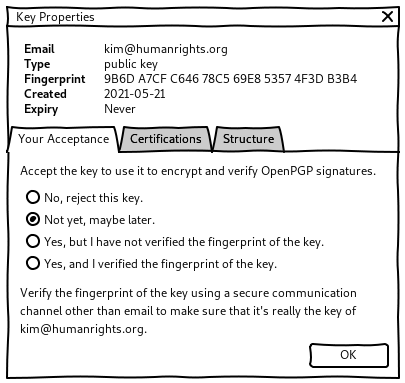

Subject encryption toggle
-------------------------

If encryption is turned on, subject encryption is turned on by default as well.

The status of subject encryption is displayed through a label **Encrypted
Subject** and can be toggled with a lock icon on the left of the subject line:

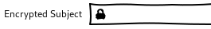

- Without the label **Encrypted Subject** but a padlock icon on the right
  of the subject line, P2 was not aware that the subject was going to be
  encrypted by default and typed a dummy subject instead:

  

  > I would put a subject that no one could understand, like "let's party".
  > ---&nbsp;P2

  Dummy subjects like these make emails harder to go back to for the
  recipients.

  When we made P2 notice the padlock icon while debriefing the tests by moving
  it to the left of the subject line, they incorrectly thought that the icon indicates that
  the encryption is working:

  

  > It means that encryption is working. ---&nbsp;P2

- With the **Encypted Subject** label, P3 discovered that it was now possible
  to encrypt the subject line as well:

  > "Encrypted Subject", cool! I understand that the subject will be
  > encrypted now. It hasn't always been the case.
  > ---&nbsp;P3

Subject encryption is also available in the [additional
options](#additional-options) for accessibility.

If encryption is turned off, the usual **Subject** line with no icon is
displayed:

Implementation and release strategy
-----------------------------------

This design could be released in increments in the following order:

1. [Encryption split button](#encryption-split-button), [additional options](#additional-options), and [OpenPGP-S/MIME split button](#openpgp-smime-split-button)

   Most pressing in terms of ease of use and visibility of system status.

   Default state could be mapped to the current "Do Not Encrypt" and "Require
   Encryption".

1. [Key notifications](#key-notifications), [Never Encrypt dialog](#never-encrypt-dialog), and [Send button](#send-button)

   More useful than recipient pills.

   Implementing the Never Encrypt dialog reduces the amount of notifications.

1. [Key properties](#key-properties)

   Not super important but easy.

1. [Recipient pills](#recipient-pills)

   Sugar on top of key notifications.

1. [Account settings](#account-settings)

   Could require more discussion.

1. [Search on key servers](#search-on-key-servers)

   At-risk and less technical users are defiant of key servers and
   already have other key distribution mechanisms.

1. [Subject encryption toggle](#subject-encryption-toggle)

   Mostly educational.
