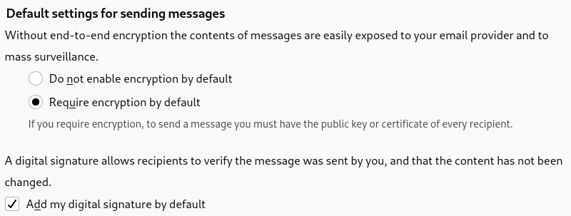

Scope
-----

This work is financed by the
[BASICS](https://internews.org/areas-of-expertise/global-tech/global-tech-projects/basics/)
project of Internews to improve the usability of OpenPGP for at-risk users:
journalists, activists, and human-rights defenders who use OpenPGP in
Thunderbird to protect their sensitive communications.

I worked with Kai, Alex, and Magnus from the Thundebird team and [Gus
Andrews](https://gusandrews.medium.com/).

I started working on the usability of OpenPGP in the composer window, because:

- Among at-risk and less technical users, the most pressing issues since the
  replacement of Enigmail seem to be the lack of an equivalent for the "Encrypt
  If Possible" option and the lack of visibility about the encryption status
  while composing an email.
- The migration from Enigmail to Thunderbird was not fun but [most
  people](https://stats.thunderbird.net/#version) have migrated by now.
- The OpenPGP feature is far from being good enough in terms of usability to
  encourage new users to use it.
- Working on the composer seemed easier and more important to tackle than key
  management and discovery as a start. I'll work on these next.

This work would address the following Bugzilla issues:

- Opportunistic encryption

  * [#135636: Implement "Encryption when possible" option for OpenPGP and S/MIME](https://bugzilla.mozilla.org/show_bug.cgi?id=135636)
  * [#1680815: Automatically enable encryption based on message recipient](https://bugzilla.mozilla.org/show_bug.cgi?id=1680815)
  * [#1711294: Missing per-recipient rules whether to use encryption lead to bad UX](https://bugzilla.mozilla.org/show_bug.cgi?id=1711294)

- Encryption status and settings in the composer window

  * [#1595226: Mail Composer - Configuring individual message settings and recipient key selection](https://bugzilla.mozilla.org/show_bug.cgi?id=1595226)
  * [#1630405: In composer, show message encryption "configuration"](https://bugzilla.mozilla.org/show_bug.cgi?id=1630405)
  * [#1681938: User experience: make it easier to see if messages to be sent will be encrypted/signed](https://bugzilla.mozilla.org/show_bug.cgi?id=1681938)
  * [#1669788: Support encrypt/sign toggle buttons in compose window](https://bugzilla.mozilla.org/show_bug.cgi?id=1669788)
  * [#1651045: Improve labels "require encryption" and "do not encrypt" in composer](https://bugzilla.mozilla.org/show_bug.cgi?id=1651045)
  * [#1630433: In composer, show individual message encryption "status"](https://bugzilla.mozilla.org/show_bug.cgi?id=1630433)
  * [#1630416: In composer, show overall pre-calculated message encryption "status"](https://bugzilla.mozilla.org/show_bug.cgi?id=1630416)
  * [#1667254: Improve the UI of the Compose window when encrypting emails](https://bugzilla.mozilla.org/show_bug.cgi?id=1667254)
  * [#1616525: openpgp, composer, when changing "from", potentially adjust encrypt/sign settings](https://bugzilla.mozilla.org/show_bug.cgi?id=1616525)
  * [#1677709: PGP: Make error message more helpful](https://bugzilla.mozilla.org/show_bug.cgi?id=1677709)
  * [#1683332: Replyto encrypted despite setting](https://bugzilla.mozilla.org/show_bug.cgi?id=1683332)
  * [#1692625: Thunderbird's UI should explain that it expects that a correspondent's OpenPGP encryption key must contain the correspondent's email address to be used immediately, and that alternatively the Alias feature could be used](https://bugzilla.mozilla.org/show_bug.cgi?id=1692625)
  * [#1710453: OpenPGP: add 2 buttons send "unencrypted/signed", "unencrypted/unsigned" early in the send workflow](https://bugzilla.mozilla.org/show_bug.cgi?id=1710453)

Methodology
-----------

I recruited 4 usability test participants who use OpenPGP in Thunderbird to
protect sensitive information as part of their work or activism. They use and
advocate for OpenPGP as a way to protect their communications from surveillance
and repression from State and private actors. I call them **at-risk** users:

- P1 (Germany), from an international peasant movement
- P2 (Brazil), from a feminist digital care network
- P3 (Colombia), from a local social movement
- P4 (Guatemala), a journalist and digital security trainer

I asked them to perform 3 tasks on 2 proposals developed by our team, [Proposal A](mockups/proposal-a.png) and Proposal B,
using the [think-aloud
protocol](https://www.nngroup.com/articles/thinking-aloud-the-1-usability-tool/):

- *Write an email to your friend renata@riseup.net about an upcoming secret action.*

  The user already had accepted a key for renata@riseup.net.

- *Write an email to book a class with your yoga teacher hello@yoga.life.*

  The participant had no key for hello@yoga.life and none was available on the key servers.

- *Write an email to schedule a meeting with a working group at your
  organization: derya@humanrights.org, kim@humanrights.org, and
  alex@humanrights.org.*

  The participant had an unaccepted key for kim@humanrights.org.
  The participant had no key for alex@humanrights.org and none was available on the key servers.

Both proposals were displayed to the test participants as paper prototypes that
I manipulated following their instructions and shared on video. I improved on
each proposal after each test, as a way of improving on the design as quickly
and cheaply as possible. This method is called [formative
testing](https://simplysecure.org/blog/formative-testing).

Gus Andrews helped interview, facilitate, and debrief the tests with P1 and P2.

Composer window
---------------

### Example screen

### Account settings

It will replace the current radio buttons:

These account settings allow people to choose between 2 main
categories: those who want to encrypt as little as possible and those who want
to encrypt as much as possible (or everything):

- **Encrypt new messages = Off** (default)

  According to [Ruoti et al.](https://arxiv.org/pdf/1510.08554.pdf), only 20%
  of non at-risk users agree with the idea that they would "encrypt email
  frequently.”.

  > Well, I'm trying to think when I would need to. It would be nice to have
  > it, in case,  but I don't know if there's anyone I would need to send that
  > information to.

- **Encrypt new messages = On** (default)

  The at-risk users who were interviewed during the usability tests want to
  encrypt as much as possible, err on the side of caution, and be asked what to
  do with key issues as part of sensitive communications.

  > Sometimes you exchange keys and you think that you have it but something
  > goes wrong. I prefer to be asked whether to send unencrypted instead of
  > having a bad surprise.
  > --- P3

  The challenge for at-risk users is to introduce enough friction in the
  composer to prevent them from sending sensitive communications unencrypted,
  while not adding too much extra burden when sending unencrypted emails.

  For example, if the key of a contact expired yesterday, they want to be
  prevented from sending them an unencrypted email by mistake. But they don't
  want to be bothered about encryption each time they write to their yoga
  teacher who doesn't use OpenPGP.

### Encryption toggle

Whether the user wants to encrypt the email or not is displayed in the label of
the **Encryption** toggle button in the toolbar, right of the **Send** button.

**Default state**

When opening the composer, encryption is turned on by default depending on
various heuristics:

- If the account is configured to **Encrypt new messages**.
- If the email is a reply to or a forward of an encrypted email.

If neither OpenPGP nor S/MIME are configured for the current identity, the
toggle is off and clicking on it could open a configuration assistant (not
designed yet).

### Recipient pills

If encryption is turned on, the status of the key for each recipient is
displayed in their recipient pill:

The icons were well understood by test participants and are simple enough to
improve accessibility at a very small size.

These pills are completed with a tooltip that provides more information and a
possible solution on hover:

The status of the key is also available in the right-click menu of the
recipient pill:

### Key notifications

If encryption is turned on, the recipient pills are completed with
notifications that appear on top of the body of the email:

Several notifications are visible at the same time. After 3
notifications, a single notification summarizes how many more notifications are
not displayed yet:

> If I'm serious about encryption, problems should be shown right away because
> I have to act on them anyway. The emails I work a lot with I have an interest
> in getting them in order. Progressively, more and more people will use PGP
> and the list will get lower in the future. It would be good to have these
> notifications because if I have 10 recipients, I don't have to click on 10
> addresses. I can immediately start to address the problems from the
> notification. -- P1

### Never Encrypt dialog

When the user chooses **Do Not Encrypt** in a notification:

- The **Encryption** split button is turned off.

- The user is proposed to remember this preference for this
  recipient in the future:

  

  This choice is undone automatically if the user ever imports a key for this
  recipient in the future.

### Send button

If encryption is turned on but the email is impossible to encrypt, the **Send**
button is made unavailable and a tooltip instructs the user to review pending
key notifications:

### About the recipients dialog

If encryption is turned on but the email is impossible to encrypt, we could
instead keep the **Send** button available and display the recipients dialog with
a list of recipients and keys when the user chooses to send the email:

Recipient pills provide a better user experience than only displaying the
recipients dialog when sending the email because:

- If encryption is possible because all keys are fine, the UX is the same.

- Recipient pills provide better *visibility of system status*
  ([Usability Heuristics #1](https://www.nngroup.com/articles/visibility-system-status/)):

  * They present feedback to the user as quickly as possible.

  * Without this immediate feedback, the encryption toggle would remain on
    while it's impossible to encrypt and without telling the user. The
    **Send** button will feel uncertain. Predictable interactions create trust.

- Recipient pills rely on *recognition rather than recall*
  ([Usability Heuristics #6](https://www.nngroup.com/articles/recognition-and-recall/)):

  * They inform the user about whether it is possible to encrypt without having
    to recall, guess, or wait until they try to send. They provide help in
    context.

- Key notifications *help users recognize, diagnose, and recover from errors*
  ([Usability Heuristics #9](https://www.nngroup.com/articles/ten-usability-heuristics/)):

  * They describe the problem and provide shortcuts that can solve the error immediately.

Once we have the recipient pills and key notifications, we could
get rid of the code for this window and save a bit on maintenance.

### Additional options

The same OpenPGP and S/MIME options are available from either:

- The **Encryption** split button.
- A dedicated top-level **Encryption** menu.

According to Kai, the options from the split button should also be available
from a top-level menu for accessibility.

Moving OpenPGP and S/MIME options to a dedicated top-level menu helps to make
them more discoverable. It also keeps the set of options in the split button
and the top-level menu consistent and helps people understand that the
top-level menu mirrors the options in the split button.

It wouldn't be a problem to keep these options in the **Options** menu as we're
doing right now as most people will rather use the split button than the
top-level menu.

The label of the **Encryption** menu is slightly incorrect
technically because this menu also includes options for
cryptographic signatures, and not only for encryption. Test
participants didn't care or didn't even know about the
cryptographic signature of OpenPGP. I assume that the
**Encryption** label is clearer and most discoverable by the vast
majority of users that are mostly interested in encryption. I
assume that the few people who are also interested in
cryptographic signatures won't have problems finding these options
in this menu despite the **Encryption** label.

### OpenPGP-S/MIME split button

If the user has accounts with both OpenPGP and S/MIME, the choice between both encryption technologies is available from:

- A dropdown, left from the **Encryption** split button.
- Radio buttons, in the **Encryption** menu.

### Search on key servers

Searching on key servers is made available from the recipient pills, their
right-click menu, and the key notifications.

None of the test participants used key servers to share their keys: some don't
know that they exist and some others avoid using them by lack of trust.

> I never search on key servers because I don't trust them. Someone
> can pretend to be someone else and send a wrong key.
> --- P2

When the user searches on key servers, it's a good opportunity to educate them
about key servers:

### Key properties

P1 didn't read the current text despite being interested in learning more
about fingerprint verification.

> I don't know what a fingerprint is so I would choose 'accepted'.
> I don't know how I can verify if the key is correct but I'm curious
> what a correct fingerprint means. I want to know. I
> would like an explanation of the difference between 'accepted' and
> 'verified'.
> --- P1

I rephrased and restructured the acceptance tab of the key properties to:

- Be less verbose on top.
- Explain better what it means to verify the fingerprint, put this
  explanation closer to where it matters, and separate it from the general
  explanation on acceptance.

### Subject encryption toggle

If encryption is turned on, subject encryption is turned on by default as well.

The status of subject encryption is displayed through a label **Encrypted
Subject** and can be toggled with a lock icon on the left of the subject line:

- Without the label **Encrypted Subject** but a padlock icon on the right
  of the subject line, P2 was not aware that the subject was going to be
  encrypted by default and typed a dummy subject instead:

  

  > I would put a subject that no one could understand, like "let's party".
  > --- P2

  Dummy subjects like these make emails harder to go back to for the
  recipients.

  When we made P2 notice the padlock icon while debriefing the tests by moving
  it to the left of the subject line, they incorrectly thought that the icon indicates that
  the encryption is working:

  

  > It means that encryption is working. --- P2

- With the **Encypted Subject** label, P3 discovered that it was now possible
  to encrypt the subject line as well:

  > "Encrypted Subject", cool! I understand that the subject will be
  > encrypted now. It hasn't always been the case.
  > --- P3

Subject encryption is also available in the [additional
options](#additional-options) for accessibility.

If encryption is turned off, the usual **Subject** line with no icon is
displayed:

Implementation and release strategy
-----------------------------------

This design could be released in increments in the following order:

1. [Encryption split button](#encryption-split-button), [additional options](#additional-options), and [OpenPGP-S/MIME split button](#openpgp-smime-split-button)

   Most pressing in terms of ease of use and visibility of system status.

   Default state could be mapped to the current "Do Not Encrypt" and "Require
   Encryption".

1. [Key notifications](#key-notifications), [Never Encrypt dialog](#never-encrypt-dialog), and [Send button](#send-button)

   More useful than recipient pills.

   Implementing the Never Encrypt dialog reduces the number of notifications.

1. [Key properties](#key-properties)

   Not super important but easy.

1. [Recipient pills](#recipient-pills)

   Sugar on top of key notifications.

1. [Account settings](#account-settings)

   Could require more discussion.

1. [Search on key servers](#search-on-key-servers)

   At-risk and less technical users are defiant of key servers and
   already have other key distribution mechanisms.

1. [Subject encryption toggle](#subject-encryption-toggle)

   Mostly educational.

Software prototype
------------------

The following patch includes proof-of-concept code for almost all the design
elements described earlier:

  - [composer.diff](patches/composer.diff)

It can be applied on top of changeset de35d92fd3ea.

This patch is a prototype made to demonstrate the design and is probably broken
in many ways. Please report any unexpected behavior.

### Known issues

- Doesn't implement the **Encrypted Subject** label.

  I want to see whether having the icon only works better for users on the
  software prototype. This label being mostly educational, it might not be a
  problem if people take some time to understand how subject encryption works.
  Going for the longer label first makes it harder to know whether the shorter
  label would be enough and simplify it in the future.

- Doesn't implement [Search on key servers](#search-on-key-servers).

- The **Send Now** entry of the **File** menu and the **Ctrl+Enter** keyboard
  shortcut still allow sending an email while there are pending key
  notifications.

- Key notifications are not updated when coming back from the **Manage
  Key…** dialog.

- Key notifications are placed on the bottom of the message instead of on top.

- Doesn't implement the link to **Manage Key…** and **Search on Key
  Servers…** in the tooltip of the recipient pills nor the shortcut to
  the key properties in the right-click menu of the recipient pill.

Next steps
----------

- Test the software prototype with more at-risk users.

- Design improvements for key management and discovery.

Variations
----------

### Encryption split button

- Merging the encryption toggle and additional options provides everything in
  the same widget under a single padlock icon. Split buttons were well
  understood by test participants.

- State-switch controls are [notoriously hard to get
  right](https://www.nngroup.com/articles/state-switch-buttons/). Reenforcing
  the toggle with a change in label and icon provides multiple and strong
  signifiers and is more accessible.
